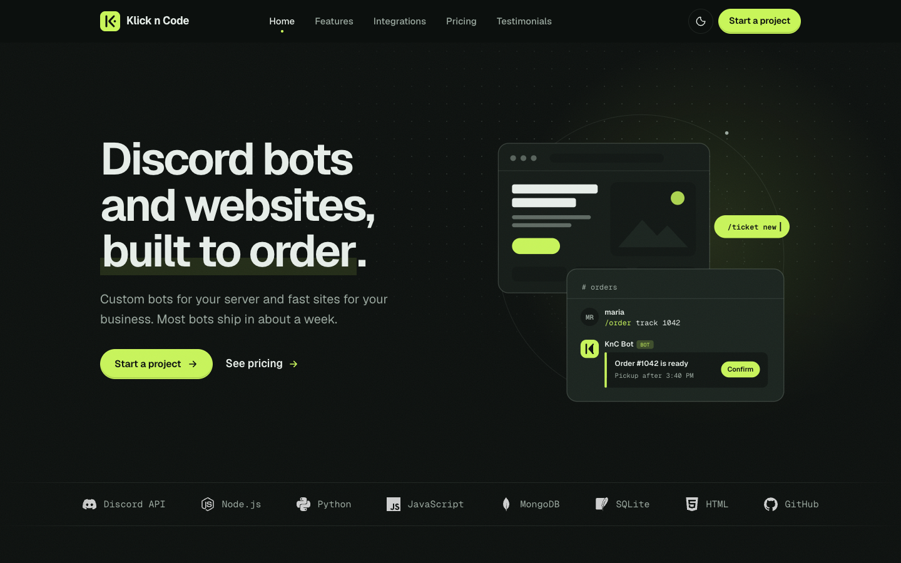
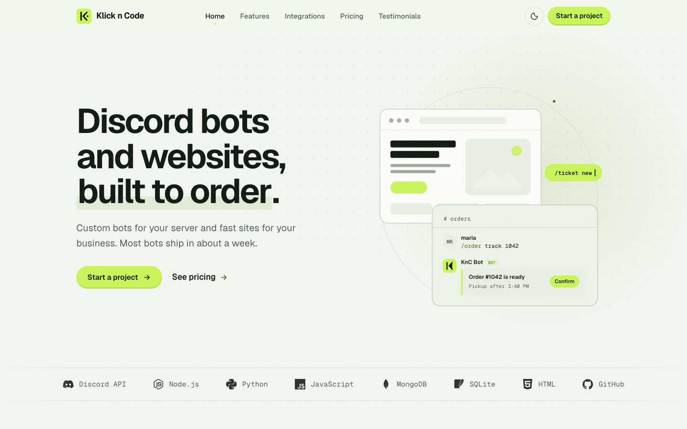
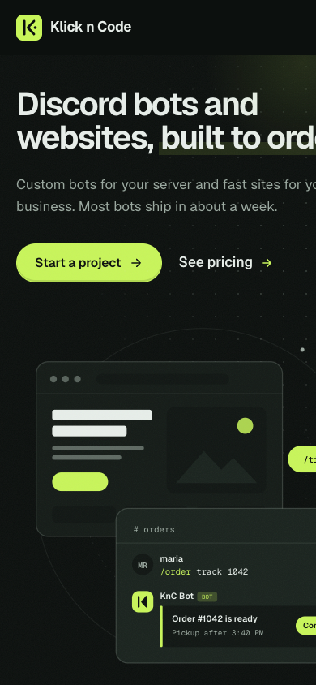
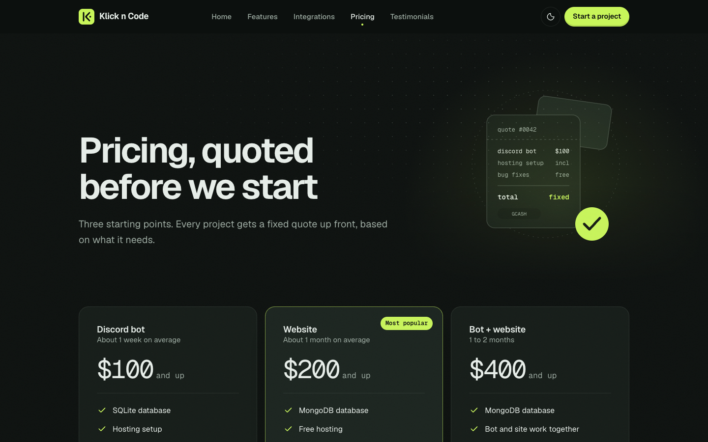
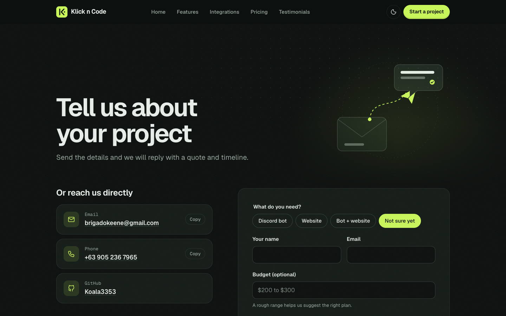

<p align="center">
  
</p>

<h1 align="center">Klick n Code</h1>

<p align="center">
  Custom Discord bots and websites for communities and small businesses.<br>
  <a href="https://koala3353.github.io/klickncode/"><strong>Visit the live site</strong></a>
</p>

<p align="center">
  
</p>

## About

Klick n Code is a freelance development service. This repository is its marketing site: a fast, dependency-free static site hosted on GitHub Pages.

## Services

| Plan | Starting price | Typical timeline | Includes |
|---|---|---|---|
| Discord bot | $100 | About 1 week | SQLite database, hosting setup, external APIs, AI features, RPG systems, web scraping |
| Website | $200 | About 1 month | MongoDB database, free hosting and domain setup, fully custom design |
| Bot + website | $400 | 1 to 2 months | Everything above, with the bot and site sharing one database |

Every project is quoted up front. Payment via GCash, Maya or crypto. Bug fixes and small tweaks after launch are free.

## Screenshots

| Light mode | Mobile |
|---|---|
|  |  |

| Pricing | Contact |
|---|---|
|  |  |

## Features

- **Custom SVG illustrations** on every page, themed through CSS variables so they follow light and dark mode
- **Scroll-driven effects** using native CSS (`animation-timeline`): parallax layers, a process timeline that draws itself, and a reading progress bar
- **Light, dark and system themes** with a remembered preference and no flash on load
- **Contact form** that validates inline and opens a pre-written email; pricing buttons pre-select the plan (`contacts.html?plan=Website`)
- **Accessible by default**: skip link, visible focus, semantic headings, alt text, native `<details>` FAQs, and full `prefers-reduced-motion` support
- **Progressive enhancement**: content is visible without JavaScript; animations only defer items below the fold

## Tech stack

- Plain HTML, CSS and JavaScript. No framework, no build step
- [Geist and Geist Mono](https://vercel.com/font) via Google Fonts
- Tech logos from [Simple Icons](https://simpleicons.org)

## Project structure

```
.
├── index.html            Home
├── features.html         What every build includes
├── integrations.html     Databases, dashboard and stack
├── pricing.html          Plans and payment terms
├── testimonials.html     Client reviews
├── faq.html              Questions (with FAQPage structured data)
├── contacts.html         Contact channels and project form
├── 404.html              Not found page
├── assets/
│   ├── css/kc.css        Design system: tokens, components, themes
│   ├── js/kc.js          Theme menu, mobile nav, reveals, form, copy buttons
│   └── img/              Logo, brand images
└── docs/screenshots/     Images used in this README
```

## Design system

All styling lives in `assets/css/kc.css`.

| Token | Dark | Light |
|---|---|---|
| Background | `#0b0f0d` | `#f3f5f0` |
| Surface | `#141b17` | `#fbfcf9` |
| Text | `#e7eee9` | `#111a14` |
| Accent | `#c8f55a` | `#c8f55a` (fills), `#3f6a0c` (text) |

Corner radii follow one rule: panels 20px, inner tiles 12px, inputs 12px, buttons fully rounded.

## Run locally

```bash
python3 -m http.server 4173
```

Then open http://localhost:4173.

## Contact

- Email: brigadokeene@gmail.com
- GitHub: [@Koala3353](https://github.com/Koala3353)
- Or use the [contact form](https://koala3353.github.io/klickncode/contacts.html)
